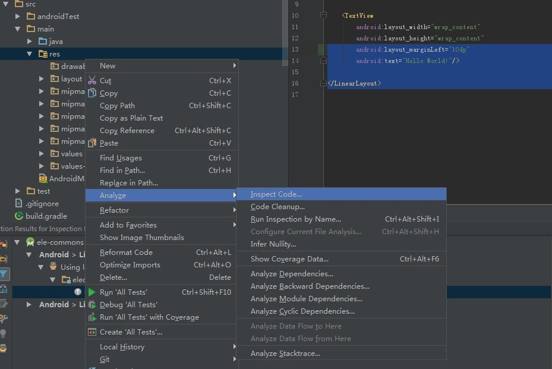
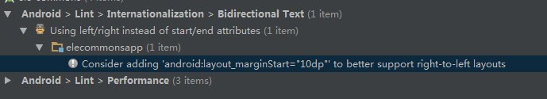

# gradle-android-rtl

[](https://jitpack.io/#znyang/gradle-android-rtl)

## 概述

用于自动修复布局文件中未添加RTL支持的标签，如果你有一个大工程需要处理。

## Android RTL Support

[Native RTL support in Android 4.2](http://android-developers.blogspot.tw/2013/03/native-rtl-support-in-android-42.html)

## 检查修改点

`Android>Lint>Internationalization>Bidirectional Text`





## 配置

```gradle
buildscript {
    repositories {
        // ...
        maven { url "https://jitpack.io" }
    }
    dependencies {
        classpath 'com.github.znyang:gradle-android-rtl:0.0.3'
    }
}

apply plugin: 'com.zen.plugin.rtl'

rtl {
    from = fileTree("${project.projectDir}/src/main/res/layout/")
    // into = "${project.buildDir}/outputs/rtl/res/layout"
}
```

## 输出

```
gradle androidRtl
```

需要修复的layout文件会生成在rtl.into的目录下，可以在确认后覆盖到你的layout目录下，再进行一遍检查！

支持的标签如下：

```java
{
    "layout_toLeftOf", "layout_toStartOf",
    "layout_toRightOf", "layout_toEndOf",

    "layout_marginLeft", "layout_marginStart",
    "layout_marginRight", "layout_marginEnd",

    "layout_alignLeft", "layout_alignStart",
    "layout_alignRight", "layout_alignEnd",

    "layout_alignParentLeft", "layout_alignParentStart",
    "layout_alignParentRight", "layout_alignParentEnd",

    "drawableLeft", "drawableStart",
    "drawableRight", "drawableEnd",
}

// padding只要存在left/right，就会补充四个标签
{
    "paddingLeft", "paddingStart",
    "paddingRight", "paddingEnd"
}
```
